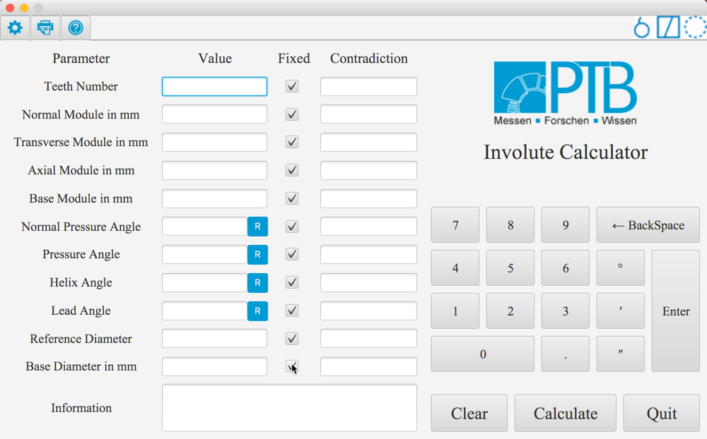
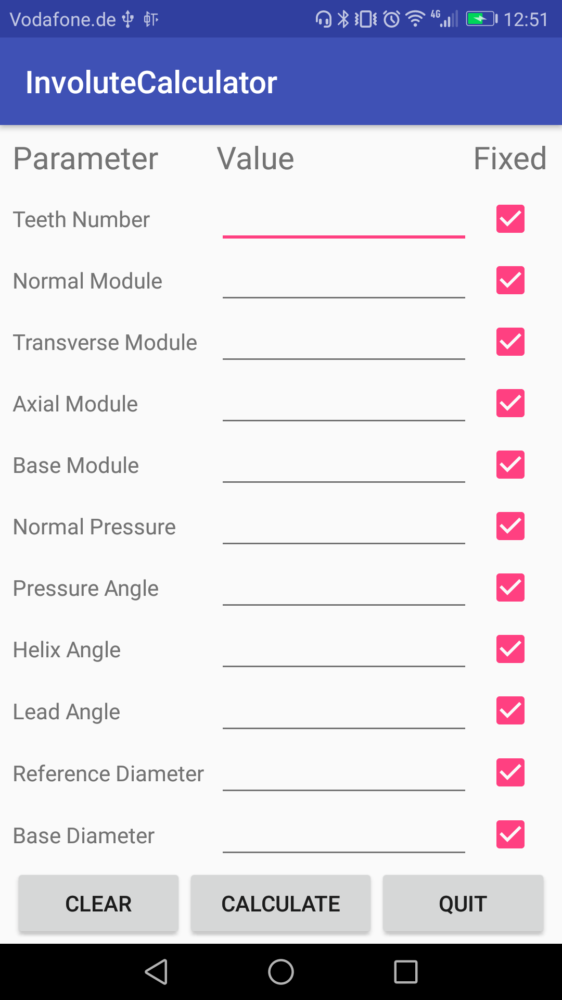
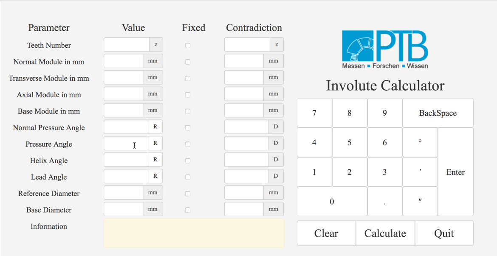

Introduction
==================

This involute calculator is the first all over world that you can input the paramters value and operate their fixed attriubte for involute gear.

What's even more surprising is that we can provide platform-cross application. That is to say you can use it on all most popular operate systems such as Windows, MacOs, Linux, Android. The application interface is shown as following pictures.

